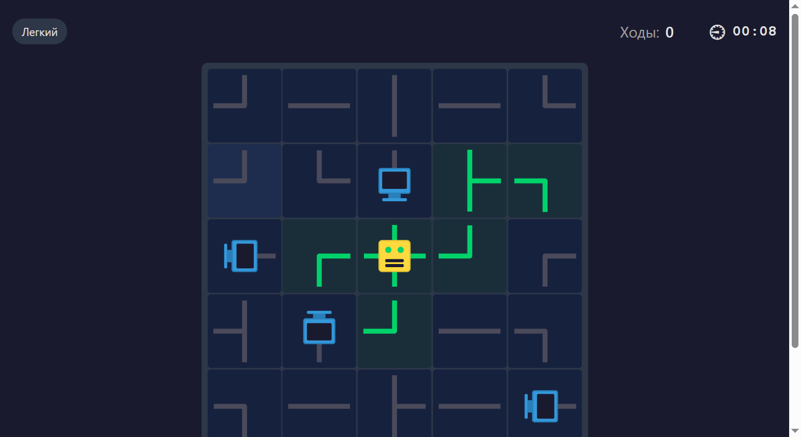
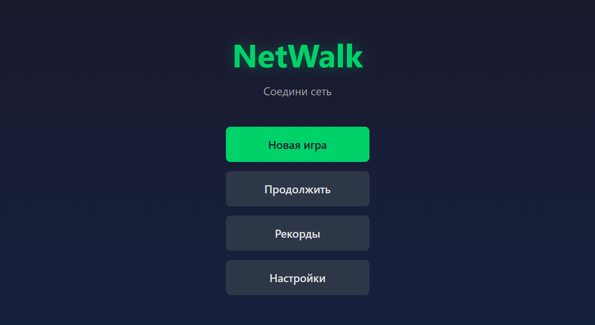
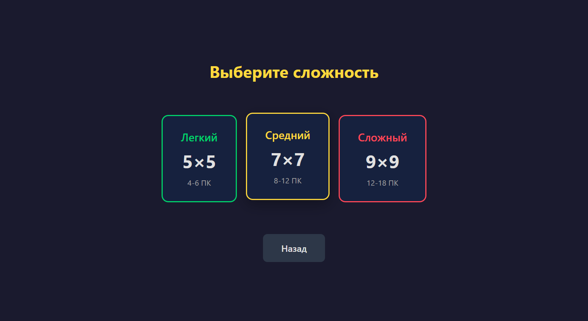
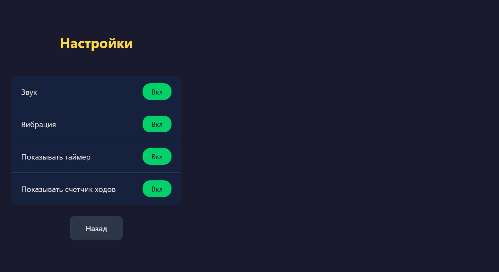

# NetWalk

Головоломка, в которой нужно соединить компьютеры с сервером, вращая сегменты кабелей.



## Правила игры

1. **Цель**: Подключить все компьютеры к центральному серверу
2. **Механика**: Кликайте на ячейки, чтобы поворачивать кабели на 90 градусов
3. **Условие победы**: Все компьютеры подключены (кабели становятся зелёными)
4. **Оптимизация**: Старайтесь решить за меньшее количество ходов и времени

### Типы ячеек

| Ячейка | Описание |
|--------|----------|
| Сервер (жёлтый) | Центральный узел — соединяется во все 4 направления |
| Компьютер (синий) | Конечное устройство — соединяется в 1 направлении |
| Прямой кабель | Соединяет 2 противоположных направления |
| Угловой кабель | Соединяет 2 соседних направления |
| Т-образный | Соединяет 3 направления |
| Крест | Соединяет все 4 направления |

### Визуальная обратная связь

- **Серые кабели** — не подключены к серверу
- **Зелёные кабели** — подключены к серверу
- **Красные кабели** — висячие концы (соединение ведёт в никуда)

## Возможности

- Три уровня сложности (Лёгкий 5×5, Средний 7×7, Сложный 9×9)
- Счётчик ходов и таймер
- Плавные анимации вращения
- Звуковые эффекты
- Таблица рекордов
- Сохранение игры (можно продолжить незавершённую партию)
- PWA (можно установить, работает офлайн)
- Поддержка мобильных устройств

## Скриншоты

### Главное меню


### Выбор сложности


### Игровой процесс


### Настройки


## Технологии

- React 18 + TypeScript
- Vite
- Zustand (управление состоянием)
- CSS Modules
- Web Audio API (звуки)
- PWA (Workbox)

## Запуск

```bash
# Установка зависимостей
npm install

# Запуск сервера разработки
npm run dev

# Сборка для продакшена
npm run build

# Запуск тестов
npm run test
```

## Docker

```bash
# Сборка и запуск
docker-compose up --build

# Доступ по адресу http://localhost:8080
```

## Лицензия

MIT
